# Docker Compose Application Architecture

## System Architecture Diagram

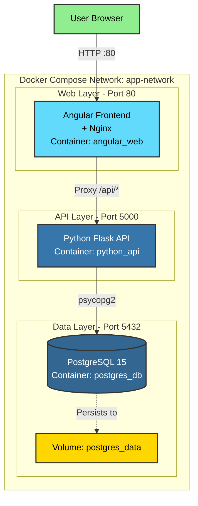

## Container Dependency Flow

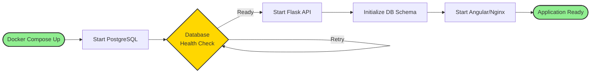

## Request Flow - User Creates a New User

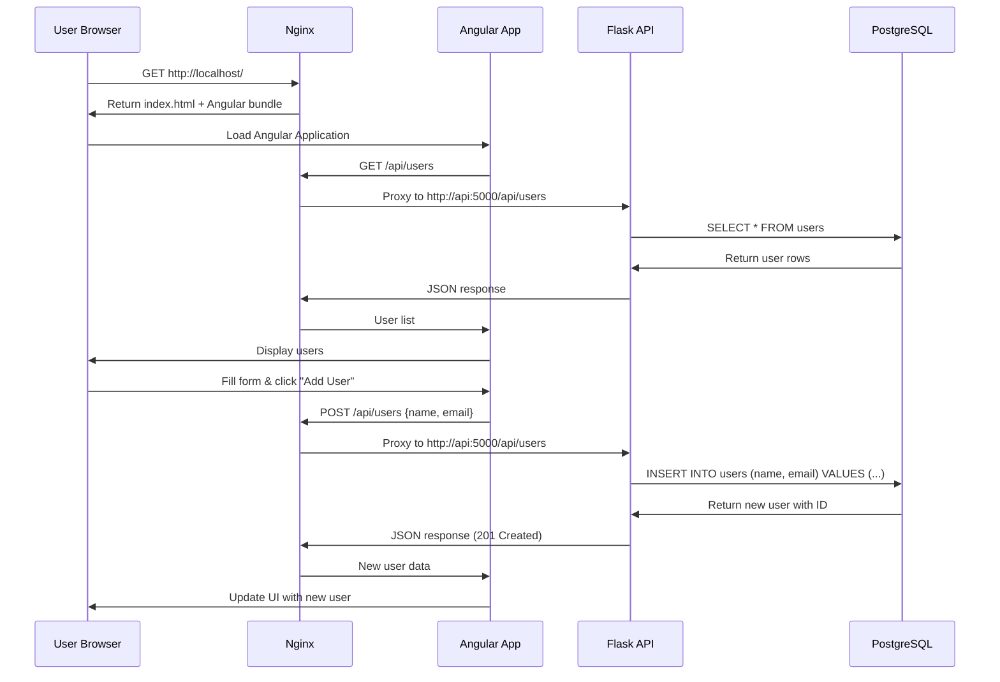

## Data Flow Architecture

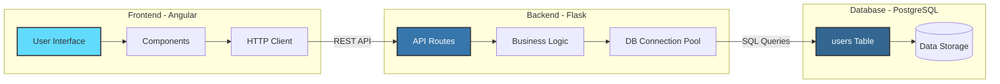

## Docker Compose Services Overview

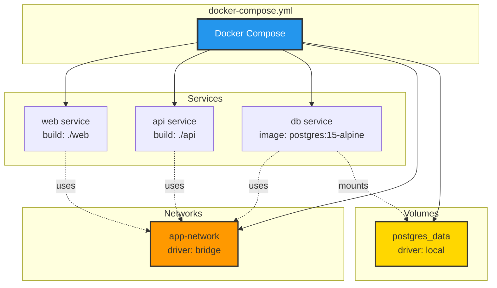

## Technology Stack

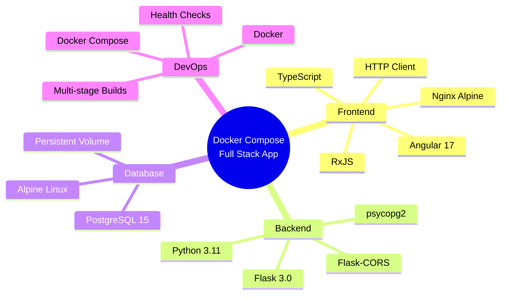

## Deployment Lifecycle

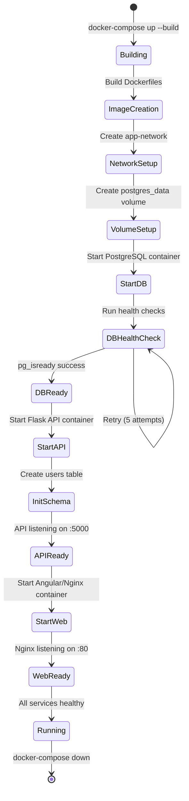

## Port Mappings & Service Communication

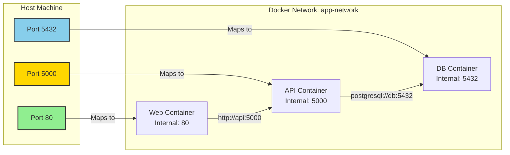

## API Endpoints Overview

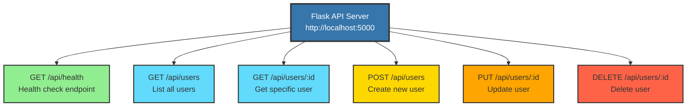

## Database Schema

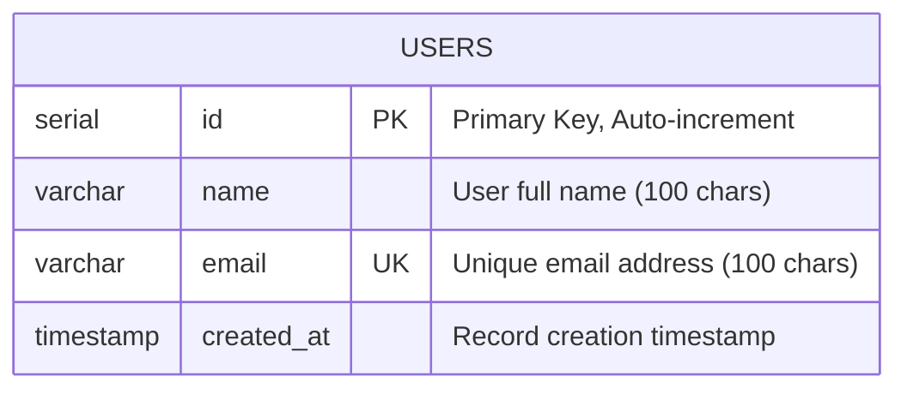

## Error Handling Flow

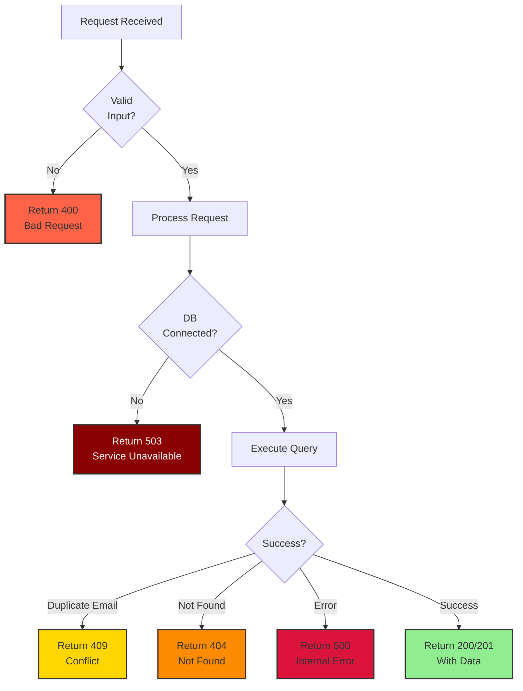
