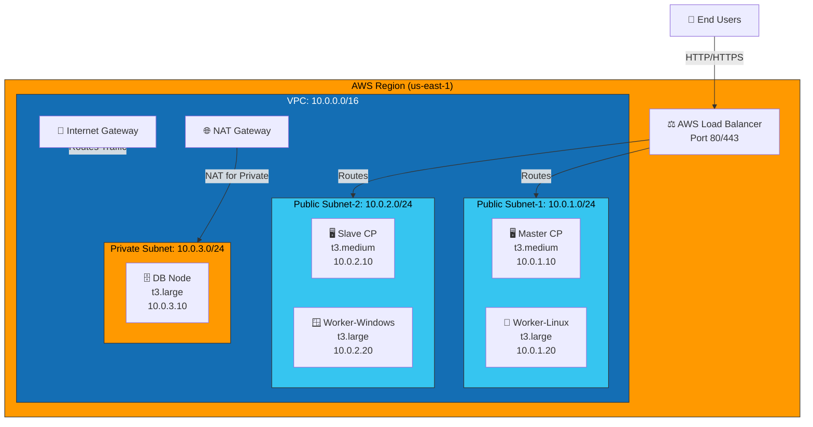
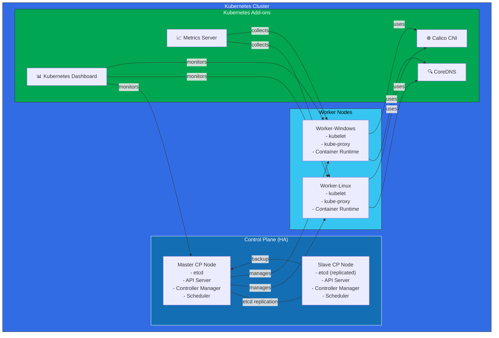
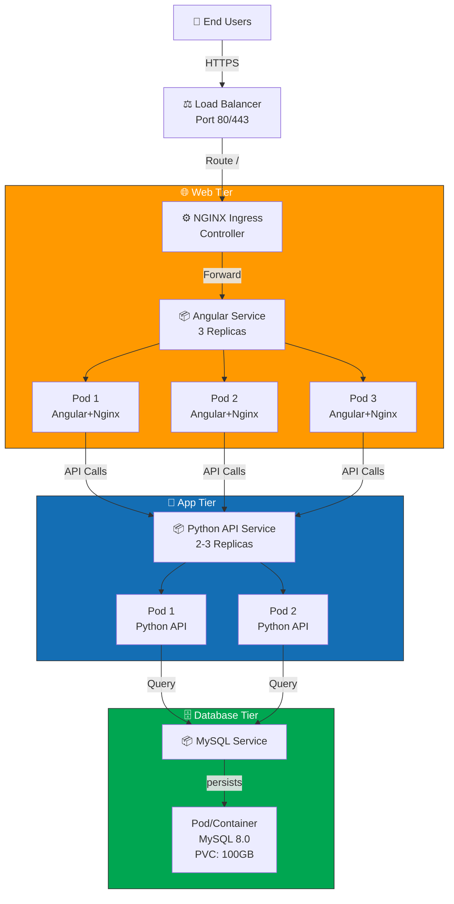
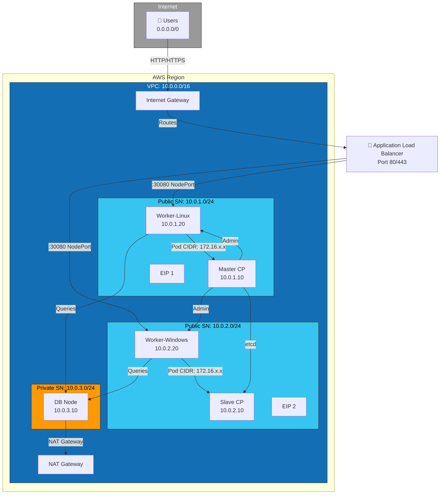
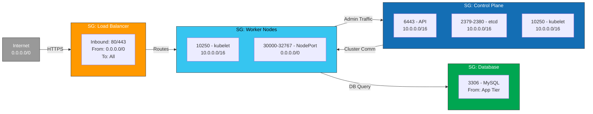
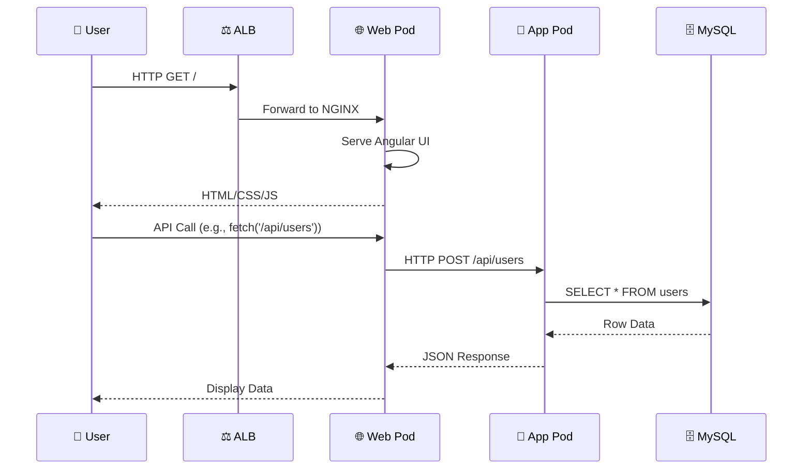
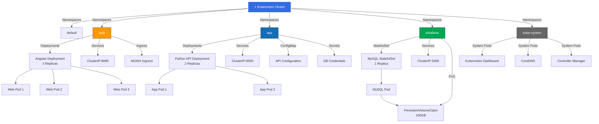
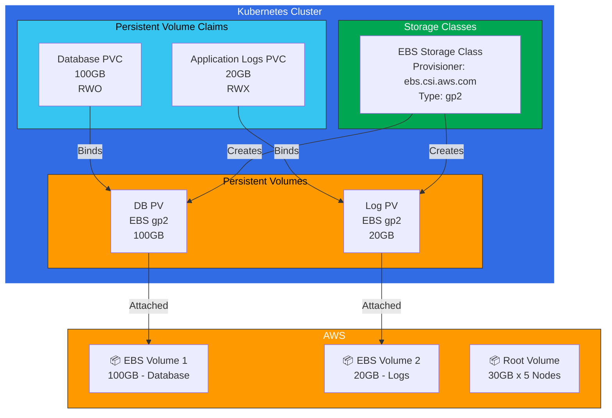
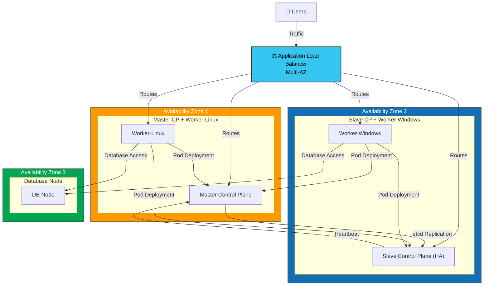

# Infrastructure & Architecture Diagrams

## 1. Overall Infrastructure Topology

---

## 2. Kubernetes Cluster Architecture

---

## 3. 3-Tier Application Architecture

---

## 4. Network Communication Flow

---

## 5. Security Groups & Firewall Rules

---

## 6. Data Flow - User Request to Database

---

## 7. Kubernetes Resource Hierarchy

---

## 8. Storage Architecture

---

## 9. Deployment Pipeline

```mermaid
graph LR
    Dev["👨‍💻 Developer"]
    Git["📚 Git Repository"]
    CI["🔄 CI Pipeline"]
    Build["🔨 Build Images"]
    Registry["📦 Container Registry"]
    Deploy["🚀 Deploy to K8s"]
    K8s["⭐ Kubernetes Cluster"]
    Monitor["📊 Monitoring"]
    
    Dev -->|Push Code| Git
    Git -->|Webhook Trigger| CI
    CI -->|Build & Test| Build
    Build -->|Push Images| Registry
    Registry -->|Pull Images| Deploy
    Deploy -->|Apply Manifests| K8s
    K8s -->|Stream Metrics| Monitor
    Monitor -->|Alerts| Dev
    
    style Dev fill:#999,stroke:#333,color:#fff
    style Git fill:#666,stroke:#333,color:#fff
    style CI fill:#146EB4,stroke:#333,color:#fff
    style Build fill:#FF9900,stroke:#333,color:#fff
    style Registry fill:#36C5F0,stroke:#333,color:#000
    style Deploy fill:#00A651,stroke:#333,color:#fff
    style K8s fill:#326CE5,stroke:#fff,color:#fff
    style Monitor fill:#FF6B6B,stroke:#333,color:#fff
```

---

## 10. High Availability Architecture

---

**Generated**: 2026-03-19  
**Status**: Architecture Documentation Complete
